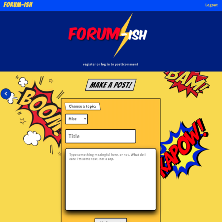
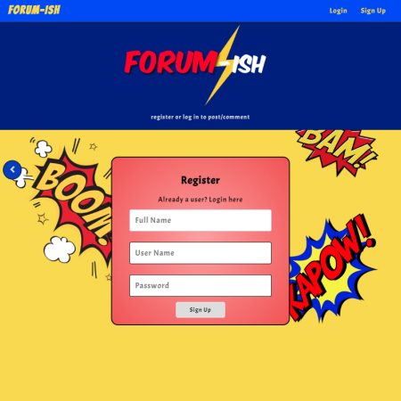

# Forum-ish - A Comic Book message board

## Overview

Full Stack Message board App

- Stack
  - Client: React, event-handlers, DOM
  - manipulation, AJAX and JWT Authentication
  - Web Server: Node and Express with PostgreSQL
  - Database: Heroku

## Live Link

[Live](https://forum-ish.kotieheim.now.sh/)

## Api

a RESTful API made using Express.js and PostreSQL hosted on Heroku.

[Server Repo](https://github.com/Kotieheim/forum-ish-server)

## Screenshots

## Summary

Forum-ish is a fun comic book themed message board where I had my brother in mind. He is an English teacher with students who are always asking him about music, stuff on the curriculum or just random topics. You are able to make a post and comment on all posts after registering and logging in. Browse through topics without the need to log in.

## Technologies Used

Made using React.js, Express.js and PostgreSQL.
